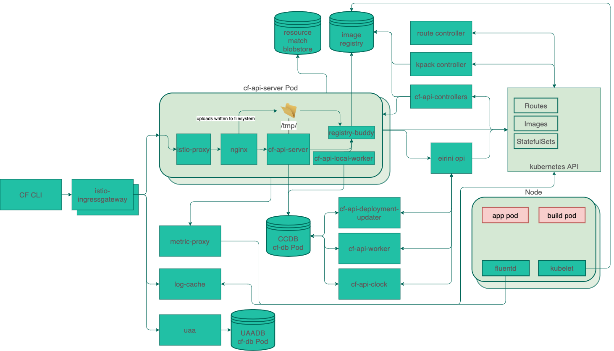

# capi-k8s-release

This collection of yaml, ytt, and go code packages together the bits that make [the CF API](http://v3-apidocs.cloudfoundry.org/) run in [cf-for-k8s](https://github.com/cloudfoundry/cf-for-k8s/). 

### Deploying

1. capi-k8s-release is best consumed as part of [cf-for-k8s](https://github.com/cloudfoundry/cf-for-k8s/)
1. Clone the `cf-for-k8s` repository: `git clone https://github.com/cloudfoundry/cf-for-k8s.git`
1. Follow [the cf-for-k8s deploy documentation](https://github.com/cloudfoundry/cf-for-k8s/blob/develop/docs/deploy.md)
  
### Components & Collaborators


[click here to edit the diagram, save as capi-k8s-release.png to persist changes](https://app.diagrams.net/?src=about#Hcloudfoundry%2Fcapi-k8s-release%2Fmaster%2Fcapi-k8s-release.png)

In this repo:
- [cf-api-controllers](https://github.com/cloudfoundry/capi-k8s-release/tree/master/src/cf-api-controllers) is a collection of kubebuilder controllers that synchronize the CF API and various k8s CRDs (Images, Builds, Routes, PeriodicSyncs, etc).
- [registry-buddy](https://github.com/cloudfoundry/capi-k8s-release/tree/master/src/registry-buddy) is sidecar service to help ruby code communicate with container registries using [go-containerregistry](https://github.com/google/go-containerregistry).
- [nginx](https://github.com/cloudfoundry/capi-k8s-release/tree/master/dockerfiles/nginx) is a custom-built nginx container including [the nginx upload module](https://github.com/vkholodkov/nginx-upload-module) for managing resumable multipart package uploads.
- [backup-metadata](https://github.com/cloudfoundry/capi-k8s-release/tree/master/src/backup-metadata) is a velero hook that collects metadata about resources currently stored in the CF API. 

From elsewhere:
- [cloud_controller_ng](https://github.com/cloudfoundry/cloud_controller_ng) is a reference implementation of the [the V3 CF API](http://v3-apidocs.cloudfoundry.org/).
- [eirini](https://github.com/cloudfoundry-incubator/eirini) is an adapter that lets Cloudfoundry Processes and Tasks run on Kubernetes
- [kpack](https://github.com/pivotal/kpack) is a collection of CRDs and Controllers for building container images from source using [Cloud Native Buildpacks](https://buildpacks.io/features/)
- [route controller & istio](https://github.com/cloudfoundry/cf-k8s-networking) are used by cf-for-k8s to manage Routes to apps and the service mesh between CF components
- [uaa](https://github.com/cloudfoundry/uaa) is used to manage users and token verification
- [cf](https://github.com/cloudfoundry/cli) is the eponymous CLI for interacting with the CF API. We support versions v7 and higher.

### Rolling out development changes to capi-k8s-release

1. `./scripts/rollout.sh` will take any local changes to `capi-k8s-release`, apply them to a local `cf-for-k8s` directory, and then deploy `cf-for-k8s`
1. `./scripts/build-and-rollout.sh` will take local changes to `cloud_controller_ng` and the components in `capi-k8s-release/src`, build them with [kbld](https://get-kbld.io/), [pack](https://github.com/buildpacks/pack), and [paketo's ruby and go buildpacks](https://github.com/paketo-buildpacks), and then deploy the new images to cf-for-k8s.

Environment variables can be used with either script to override default local source directories and remote image repositories.

### Configuring Honeycomb

For debugging, it may be useful to emit events to Honeycomb. This can be done by
passing an additional data file with a library annotation to the `ytt` command
that builds the cf-for-k8s manifest, or to one of our `rollout.sh` scripts.

```
#@library/ref "@capi-k8s-release"
#@data/values
---
honeycomb:
  dataset: my-capi-dataset
  write_key: MY_WRITE_KEY
```


### Configuring pushes of buildpack apps

`capi-k8s-release` currently uploads app source code to a blobstore, but then hands that off to `kpack` to build app images that are then placed in a registry.  In order for this to work, you must configure the following values:

```yaml
kpack:
  registry:
    hostname: # the hostname of the registry, used for authentication
    repository: # the destination of the build app images within the registry
    username: # basic auth registry username
    password: # basic auth registry password
```

dockerhub example:
```yaml
kpack:
  registry:
    hostname: https://index.docker.io/v1/
    repository: cloudfoundry/capi
    username: <username>
    password: <password>
```

gcr example:
```yaml
kpack:
  registry:
    hostname: gcr.io
    repository: gcr.io/cloudfoundry/capi
    username: <username>
    password: <password>
```
